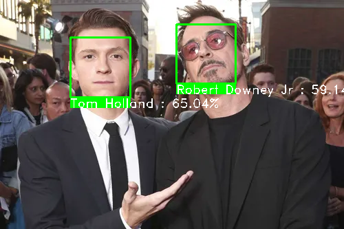
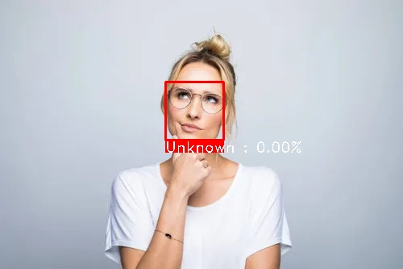

# Advanced Face Recognition System

This project implements an advanced face recognition system that can detect, track, and match faces in real-time from a webcam feed and static images. The system utilizes **dlib**'s face detection, recognition, and landmark prediction models to perform face matching against a set of known reference images.

The project includes:
- **Real-time webcam matching** with face tracking.
- **Image-based face matching** to compare faces from static images.
- **Multiple face detection**: Detect and track multiple faces at once.
- **Unknown face handling**: Save unknown faces for further analysis.

## Features
- Detect and track multiple faces in real-time.
- Compare detected faces with a database of reference images.
- Display face recognition confidence scores.
- Save images of unknown faces for future processing.

## Installation

1. Clone the repository:
    ```bash
    git clone https://github.com/SaiDhinakar/Face-Matching-System.git
    cd Face-Matching-System
    ```

2. Install dependencies:
    ```bash
    pip install -r requirements.txt
    ```
    
3. Organize your reference images:
    - Create a folder named `images/` and inside it, create subfolders for each person.
    - Each subfolder should contain images of that person (e.g., `images/person1/image1.jpg`, `images/person1/image2.jpg`).

## Usage

### Webcam Matching
To start face recognition from the webcam, simply run the script:
```bash
# main.py - call start_webcam_matching()
python main.py
```
The system will show a live feed from the webcam and attempt to recognize any faces. Press `q` to quit.

### Image Matching
To match faces in a static image, use the following command:
```bash
# main.py - call start_image_matching()
python main.py
```

## Screenshots

### Image Matching
The following example shows the output of the system recognizing faces in a static image:

| Known Persons | Unknown Person |
|------------------|----------------|
|  |  |


## Directory Structure

```
face-recognition/
├── dlib_models/
│   ├── shape_predictor_68_face_landmarks.dat
│   └── dlib_face_recognition_resnet_model_v1.dat
├── images/
│   ├── person1/
│   │   ├── image1.jpg
│   │   └── image2.jpg
│   └── person2/
│       ├── image1.jpg
│       └── image2.jpg
├── unknown_faces/
├── screenshots/
│   ├── Multiple_Face_Matching_screenshot_29.01.2025.jpg
│   └── Face-Matching.jpg
│   
├── main.py
├── requirements.txt
└── README.md
```

## Requirements
- Python 3.7 or above
- dlib
- OpenCV
- numpy

Install all dependencies from `requirements.txt`.

